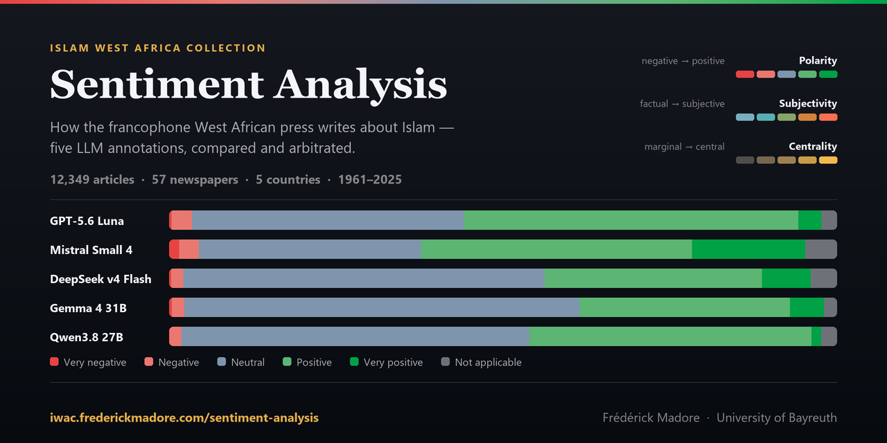

# IWAC Sentiment Analysis

[](https://github.com/fmadore/IWAC-sentiment-analysis/actions/workflows/deploy.yml)
[](https://doi.org/10.5281/zenodo.21806223)
[](LICENSE)
[](https://orcid.org/0000-0003-0959-2092)
[](https://huggingface.co/datasets/fmadore/islam-west-africa-collection)



A SvelteKit dashboard for exploring how large language models annotated the same corpus — 12,349 francophone West African press articles from 57 newspapers in Benin, Burkina Faso, Côte d'Ivoire, Niger and Togo, published 1961–2025 — on three dimensions: **polarity**, **subjectivity**, and the **centrality** of Islam and Muslims to the article. The current panel is five models; the archived one is three.

The corpus is the [_Islam West Africa Collection_](https://islam.zmo.de/s/afrique_ouest/page/accueil) (IWAC). The dashboard reports each model's distributions, their agreement, where they diverge, and blind third-party arbiter verdicts on the sharpest disagreements.

**Live site:** <https://iwac.frederickmadore.com/sentiment-analysis/>

Two top-level areas: `ma-visualisation-sentiments/` (the SvelteKit app) and `data-preprocess/` (the Python that builds its JSON payloads).

---

## Two analysis generations

The corpus has been annotated twice, under two different prompts. **Both are published side by side.** Generation 2 is what the dashboard shows by default; generation 1 stays online, unchanged, so figures and URLs published from it keep resolving.

|                    | **v2 — current**                                                                  | **v1 — archived**                                       |
| ------------------ | --------------------------------------------------------------------------------- | ------------------------------------------------------- |
| Models             | GPT-5.6 Luna, Mistral Small 4 (2603), DeepSeek v4 Flash, Gemma 4 31B, Qwen3.8 27B | GPT-5 mini, Gemini 3 Flash preview, Ministral 14B 2512  |
| Repo ids           | `luna`, `mistral-small`, `deepseek`, `gemma`, `qwen`                              | `chatgpt`, `gemini`, `mistral`                          |
| Pairs              | 10                                                                                | 3                                                       |
| Articles annotated | 12,298 of 12,349 — except Qwen3.8 27B, at 12,098                                  | 12,279 of 12,349                                        |
| Subjectivity       | ordinal label upstream, mapped to rank 1–5; declined → `null`                     | integer 1–5                                             |
| Arbiter            | Claude Opus 5, **whole panel** (one verdict per article)                          | Gemini 3 Pro, **pairwise** (one verdict per model pair) |
| Contract           | `src/lib/data/sentiment-v2.json`                                                  | `src/lib/data/sentiment-v1.json`                        |

**The generation is derived from the id, never stored.** There is no `generation` URL parameter: `generationOf()` in `src/lib/domain/sentimentContract.ts` reads it off the dataset or pair id, which is why the two generations' ids must never collide (an import-time invariant asserts this). `?dataset=chatgpt` and `?pair=chatgpt-gemini` therefore keep working exactly as before and land you in the archive.

**Reaching the archive:** the model pickers offer only the current generation. A quiet footnote link in the methodology card switches to v1, after which a banner makes the state unmistakable with one click back.

### Reading a v1 ↔ v2 difference

The v2 prompt is not the v1 prompt. Subjectivity is answered as a label (`Très objectif` … `Très subjectif`) rather than an integer, the self-checklist instruction is gone, and boundary rules were added for Muslim actors in secular stories, Arab-state cooperation, and armed groups. **A difference between the two generations confounds the model change with the prompt change** — say so when reporting one. The app never mixes them: agreement statistics, prefetching and comparison pairs are all scoped to the active generation, because a six-rater kappa would measure the prompt rewrite as if it were disagreement between models.

Three further caveats specific to v2:

- The 51 articles that are neither French nor English are **skipped by design**. The prompt is French, and a French-prompted model returns confident but unusable output for them. They ship as all-null rows.
- **Qwen3.8 27B is 200 articles short of the rest of the panel**, and permanently so: it declined them across a full pass and three further rounds of retries, after which they were retired. The gap is **not missing at random** — it falls disproportionately on articles where Islam is peripheral (6.2% of the articles the panel calls `Marginal`, against ~1% of every other centrality band). Anything computed on complete cases — Fleiss' κ, the consensus charts, the arbiter's selection frame — therefore leans towards material where Islam is central. Do not present the gap as repairable.
- Subjectivity is declined more often than the other dimensions, so statistics involving it rest on a smaller sample: **DeepSeek v4 Flash on 489 of the articles it otherwise analysed** (11,809 usable), Gemma 4 31B on 243, Qwen3.8 27B on 287.

> `chatgpt`/`gemini`/`mistral` are this repo's ids, not the dataset's column prefixes — the Hugging Face dataset renamed its sentiment columns from vendor slots to the model that actually produced each annotation. `iwac_preprocess.contract` holds the mapping and `sentiment_column()` is the only place a column name is assembled.

---

## What you can explore

Thirteen views, all sharing one filter rail (country → newspaper → polarity → subjectivity → centrality) except the three self-contained ones. Filter state round-trips through the URL, so any view is shareable.

| View             | What it answers                                                                           |
| ---------------- | ----------------------------------------------------------------------------------------- |
| **Charts**       | Polarity and subjectivity distributions per newspaper — bars or global pie                |
| **Trends**       | Polarity over time, as counts or as 100% stacked shares                                   |
| **Distribution** | Polarity × subjectivity cross-tabulation, with Spearman's ρ, p and n                      |
| **Volume**       | Publication volume per country over time — stacked areas or lines                         |
| **Heatmap**      | Centrality by country and year                                                            |
| **Seasonality**  | Coverage across the twelve Hijri months — polar cycle or bars                             |
| **Newspapers**   | Titles ranked by mean polarity, subjectivity or centrality, with 95% CIs                  |
| **Map**          | Bubble map of geocoded places cited by the corpus, coloured by any dimension              |
| **Table**        | The article list, sortable and paginated; detail modal carries the model's justifications |
| **Comparison**★  | Two models side by side, with per-dimension discrepancies and where they diverge          |
| **Agreement**★   | Cohen's κ, weighted κ, Fleiss' κ, confusion matrices, per-model calibration               |
| **Extremes**     | Keywords characterising the most extreme cases per category and model                     |
| **Arbiter**★     | Blind third-party verdicts on articles the models disagreed about most                    |

★ self-contained: full-width, own internal filters, no shared rail.

### Notes worth reading before interpreting

- **Seasonality exists because the Gregorian axis hides it.** The Hijri year drifts ~11 days a year, so lunar patterns are invisible in any year- or month-based view. Coverage nearly doubles during Ramadan and the hajj months. Conversions use the tabular (arithmetic) Islamic calendar, stated on the chart.
- **The map counts mentions, not aboutness.** A bubble counts articles that _mention_ a place (`dcterms:spatial` is item-level tagging, ~3.8 places per article), never articles _about_ it. `Non applicable` is excluded from the mean but the article is still counted — it means "no stance expressed", so averaging it in would drag heavily-covered places toward the negative pole.
- **Agreement offers only corpus-scope facets** (country, newspaper). Sentiment filters are deliberately absent: selecting by the label under comparison would make the statistics circular. A large gap between unweighted and quadratic-weighted κ signals a systematic offset rather than genuine conflict. Panel-scope statistics count only articles _every_ model rated, so on v2 they inherit Qwen's coverage gap.
- **"Who breaks ranks" means something different at five models than at three.** The dissent profile names a model only when it stands alone against all the others; a 3–2 split has no lone dissenter and lands in "divided several ways". The ternary triangle is offered for the three-model archive only — a simplex over five models has no honest 2-D projection.
- **Newspaper ranking omits titles under 30 rated articles**, and states how many it omitted.
- **Discrepancies are not errors.** No model is ground truth, and disagreement often reflects a legitimate difference of reading. `Non applicable` and `Non abordé` are treated as non-comparable and exclude the row rather than counting as maximal disagreement; missing subjectivity skips only that dimension.
- **Arbiter percentages are conditional.** The arbiter reviews only articles selected _because_ the models disagreed sharply, so its verdicts measure who is right given a disagreement — never which model is better across the corpus.
- **Sentiment is not encoded by hue alone.** The polarity ramp is equal-lightness at the poles, so tooltip swatches also carry a shape.

### Example URLs

```
# Charts, filtered to one country
?view=charts&countries=Togo

# Trends in English, positive polarity only
?view=trends&lang=en&polarities=Positif

# Comparison mode on a generation-2 pair, wide discrepancies only
# (the v2 panel has ten pairs; `pair` takes any of them)
?view=comparison&compare=true&pair=deepseek-qwen&diffMin=2&diffMax=11

# Heatmap restricted to high centrality
?view=heatmap&centralities=Central&centralities=Très%20central

# The archived generation-1 analysis
?dataset=chatgpt
```

Parameters: `view`, `lang`, `dataset`, `compare`, `pair`, `countries`, `journals`, `polarities`, `subjectivities`, `centralities`, `diffMin`, `diffMax`.

---

## Data

Everything ships as static JSON under `ma-visualisation-sentiments/static/data/`. The split is for load time, not tidiness.

| File                                        | Contents                                                                                      |
| ------------------------------------------- | --------------------------------------------------------------------------------------------- |
| `iwac_articles_base.json`                   | Shared article metadata, stored once for **both** generations (3.8 MiB, 598 KiB gzip)         |
| `iwac_sentiment_{model}.json`               | One model's scores keyed by article id (~58 KiB gzip)                                         |
| `iwac_justifications_{model}_{00..31}.json` | The ~90% prose portion, deterministically sharded by article id                               |
| `iwac_extreme_analysis_{model}.json`        | Keyword analysis of extreme cases, normalised (index + per-category id lists)                 |
| `iwac_arbiter_evaluations_{pair}.json`      | v1 pairwise arbiter verdicts (Gemini 3 Pro)                                                   |
| `iwac_arbiter_evaluations_v2.json`          | v2 panel arbiter verdicts (Claude Opus 5) — **see below**                                     |
| `iwac_places.json`                          | Geocoded `Lieux` authority records plus an article → place **edge list**                      |
| `world-110m.geojson`                        | Natural Earth 1:110m basemap (public domain), minified on purpose                             |
| `iwac_data_manifest.json` / `_v2.json`      | Per-generation contract version, immutable HF revision, byte sizes and SHA-256 for every file |

The frontend validates each JSON boundary at runtime, joins base metadata to the selected model's score map by article id, and exposes a retryable error state on failure. Only the selected model's scores load at startup; prose loads when an article detail opens (one shard) or a CSV is exported (all shards, in bounded batches); other models load when comparison mode activates; the map, arbiter and extremes data load with their views.

Places ship as edges rather than pre-computed averages so the map answers to the same filter rail as every other view; aggregation happens in the browser.

### The generation-2 arbiter run has not been published

`data-preprocess/arbiter-evaluation-v2.py` and the dashboard view are both in place, but the run is paid and hand-triggered, so `iwac_arbiter_evaluations_v2.json` is not in the repo yet. Until it is, the arbiter view under v2 shows an honest empty state telling you how to produce it. The v1 pairwise arbiter data is complete and unaffected.

How the v2 arbiter differs from v1, and why:

- **Selection is the spread across the whole panel** (max minus min across every model, per dimension) rather than a pairwise gap. On the five-model panel the contract rule (any dimension ≥ 3) selects 2,102 articles, but 1,762 of those are triggered by _subjectivity_ alone — the dimension the models argue about most and where "who is right" is least well defined. Polarity triggers 103 and centrality 239. Widening the panel widened the frame: three models selected 1,449. `--dimensions` and `--threshold` narrow the rule; they can only ever tighten it, because the validator recomputes eligibility from the contract.
- **The arbiter reads unmasked article text.** This fixes a real v1 flaw: the public Hugging Face projection masks `OCR` per row, so a large share of v1-arbitrated articles were judged on an empty string. v2 reads the private mirror (needs `HF_TOKEN`) and records **both** revisions — public scores and private text — in the metadata and the cache fingerprint. Only verdicts and justifications are published; no OCR is ever serialised.
- **Blind assignment is one global permutation** of the model ids onto labels A–E, persisted and reused by every incremental run, so cached and new rows always mean the same thing. `parseArbiterV2EvaluationData` rejects any file whose permutation is not a bijection over the contract's models, which is also what keeps the label list and the panel the same size.

### Regenerating the data

Python 3.12+, from the repo root:

```bash
pip install -r data-preprocess/requirements-dev.txt
```

**`--generation` is required and deliberately has no default.** An unflagged re-run would rewrite the frozen v1 files from whatever revision is current. A v2 run does not write `iwac_articles_base.json` at all — it asserts the live article id set still matches the frozen base and fails loudly on drift.

```bash
# Scores, prose shards and the per-generation manifest
python data-preprocess/data-fetch.py --generation v2

# Keyword analysis of extreme cases
python data-preprocess/extreme-analysis.py --generation v2

# Map payload (generation-independent)
python data-preprocess/places-export.py

# Basemap — only when the Natural Earth source itself changes
python data-preprocess/basemap-export.py
```

Arbiter runs cost money and are gated behind a dry run and a confirmation:

```bash
# v2, three-way: counts and a cost estimate, no API call
python data-preprocess/arbiter-evaluation-v2.py --dry-run

# ...then, to actually spend (needs ANTHROPIC_API_KEY and HF_TOKEN)
python data-preprocess/arbiter-evaluation-v2.py --dimensions polarity --yes

# v1, pairwise (needs GOOGLE_API_KEY); frozen — reconcile only
python data-preprocess/arbiter-evaluation.py --prune-cache-only
```

`data-preprocess/significant-differences-export.py` is a side helper rather than part of the pipeline: it writes ad-hoc CSVs of the sharpest pairwise disagreements into `exports/`, nothing the dashboard reads. It resolves its pairs through `shared.py`, so it still covers **generation 1 only**.

Validate before committing generated data:

```bash
python -m pytest data-preprocess -q && python data-preprocess/validate_generated_data.py
```

86 tests, plus a validator that checks category domains, article-id coverage, prose shard placement, arbiter eligibility and fingerprints, and manifest hashes — entirely offline, for both generations. Both Python and TypeScript read the same checked-in contracts, and shared fixtures assert identical discrepancy and label-mapping behaviour across the two languages.

Environment variables live in a root `.env`: `HF_TOKEN` (private mirror), `ANTHROPIC_API_KEY` (v2 arbiter), `GOOGLE_API_KEY` (v1 arbiter).

---

## Development

Node 24+.

```bash
cd ma-visualisation-sentiments && npm install && npm run dev
```

| Script             | What it does                                                                |
| ------------------ | --------------------------------------------------------------------------- |
| `npm run dev`      | Dev server at `localhost:5173`                                              |
| `npm run build`    | Production build, then nesting, service-worker stamping and artifact checks |
| `npm run preview`  | Serve the production build                                                  |
| `npm run check`    | `svelte-check` — must report 0 errors, 0 warnings                           |
| `npm run lint`     | Prettier, ESLint, store-cycle detection, design-token validation            |
| `npm run test:run` | 492 Vitest unit and integration tests across 27 files                       |
| `npm run test:e2e` | Playwright deep-link, failure-state and axe accessibility smoke tests       |

Run the checks in [`.claude/skills/verify/SKILL.md`](.claude/skills/verify/SKILL.md) before committing anything that ships through CI — the ordering and pass criteria are not guessable. CSS and component rules are in [DESIGN.md](DESIGN.md), and `npm run lint` enforces most of them.

Two repo-level helpers run against the root `.venv`:

- `python scripts/social-preview.py` regenerates `static/social-preview.png` from the shipped data. Re-run after a data refresh.
- `python scripts/oklch-to-hex.py` prints the sRGB renderings of the OKLCH design tokens, for the chart palette and `theme-color` meta tags.

### Architecture

- **`src/lib/components/`** — grouped by role: `common/`, `layout/`, `filters/`, `viz/` (ECharts charts and the MapLibre map), `ui/`, `data-display/`.
- **`src/lib/stores/`** — Svelte 5 runes accessor objects, one per domain (`filters`, `articles`, `datasets`, `comparison`, `arbiter`, `arbiterV2`, `extreme-analysis`, `ui`), plus `url/` for filter-state ↔ URL synchronisation. Leaf stores import from no other store; modules inside `stores/` must never import the barrel.
- **`src/lib/utils/`** — pure helpers, including the statistics modules: `agreement.ts` (Cohen's/Fleiss' κ), `correlation.ts` (Spearman's ρ), `newspaperRanking.ts`, `hijri.ts`, `placeAggregation.ts`.
- **`src/lib/domain/sentimentContract.ts`** — the dual-generation registry, with import-time invariants for id collisions, pair membership, shared scales and shard counts.
- **`data-preprocess/iwac_preprocess/`** — importable package split into the per-generation contract, source normalisation, discrepancy rules, atomic serialisation and arbiter-cache reconciliation. `shared.py` remains a compatibility facade for the command-line scripts.

Built with Svelte 5 (runes), SvelteKit 2 + `adapter-static`, TypeScript in strict mode, Tailwind CSS v4, ECharts 6, MapLibre GL v6, and Vite 8 (Rolldown). The design system is repository-owned: CSS tokens plus reusable Svelte controls, with automated token and class checks.

### Performance

Initial JavaScript is measured at build time against a **300 KiB gzip budget** — currently 129 KiB. View-level code splitting keeps charts, map, tables, comparison, agreement, extremes and arbiter in lazy chunks; MapLibre alone is larger than the rest of the vendor bundle combined, so the map view sits behind a memoized dynamic import. The service worker keeps corpus files in a deploy-stable cache so a new release doesn't re-download them. The build intentionally emits no `.gz`/`.br` siblings — GitHub Pages negotiates transfer compression, and duplicating every asset only bloated the artifact.

---

## Deployment

Every push to `main` runs `.github/workflows/deploy.yml`. Frontend and Python jobs run in parallel: type checks, lint, unit tests, the measured production build, Playwright/axe, Python tests, Ruff, npm audit, pip-audit and pull-request dependency review all gate deployment. Actions are pinned to immutable commit SHAs, and only the deploy job receives Pages permissions.

The site is served from a **custom subdomain at a sub-path**, so the build output is nested: the adapter writes the app into `build/sentiment-analysis/`, and `scripts/nest-build.mjs` populates the build root with the three files GitHub Pages only reads from there (`CNAME`, a hoisted `404.html`, and a redirect `index.html`). This is necessary because a GitHub _project page_ supplies the `/repo-name/` prefix itself, whereas a _custom domain_ serves the artifact at the subdomain root.

`ma-visualisation-sentiments/deploy.config.js` is the single source of truth for the path and the domain — changing where the dashboard is served means editing that file and nothing else. `DEPLOY_PATH = ''` serves it at the subdomain root instead.

## Citation

Each release is archived on Zenodo. Machine-readable metadata lives in [`CITATION.cff`](CITATION.cff); GitHub's _Cite this repository_ button renders APA and BibTeX from it.

Cite the concept DOI — `10.5281/zenodo.21806223` — unless you need to pin a specific version; it always resolves to the most recent release.

> Madore, F. (2026). _IWAC Sentiment Analysis Visualization_ (Version 4.1.0) [Computer software]. University of Bayreuth. https://doi.org/10.5281/zenodo.21806223

```bibtex
@software{madore_iwac_sentiment_analysis,
  author    = {Madore, Frédérick},
  title     = {IWAC Sentiment Analysis Visualization},
  version   = {4.1.0},
  year      = {2026},
  publisher = {Zenodo},
  doi       = {10.5281/zenodo.21806223},
  url       = {https://github.com/fmadore/IWAC-sentiment-analysis},
  license   = {MIT}
}
```

Cite the underlying corpus separately — the _Islam West Africa Collection_ ([islam.zmo.de](https://islam.zmo.de/s/afrique_ouest/)) and its machine-readable export ([doi:10.57967/hf/9857](https://doi.org/10.57967/hf/9857)).

## License

The application code is released under the [MIT License](LICENSE). The IWAC corpus it visualizes is distributed under CC BY-NC-SA 4.0 and is **not** covered by that licence — reuse of the data follows the collection's own terms.
